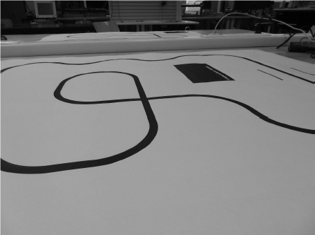

# LineFollower

lege repository die je als template kan gebruiken om een eigen repository te starten voor uw linefollower project

  
## Specifications

Microcontroller:

Motors: 

H-bridge:

Sensors:

Batteries:

Wireless communication:

Distance sensor - Motors:

Weight:

Speed: 

